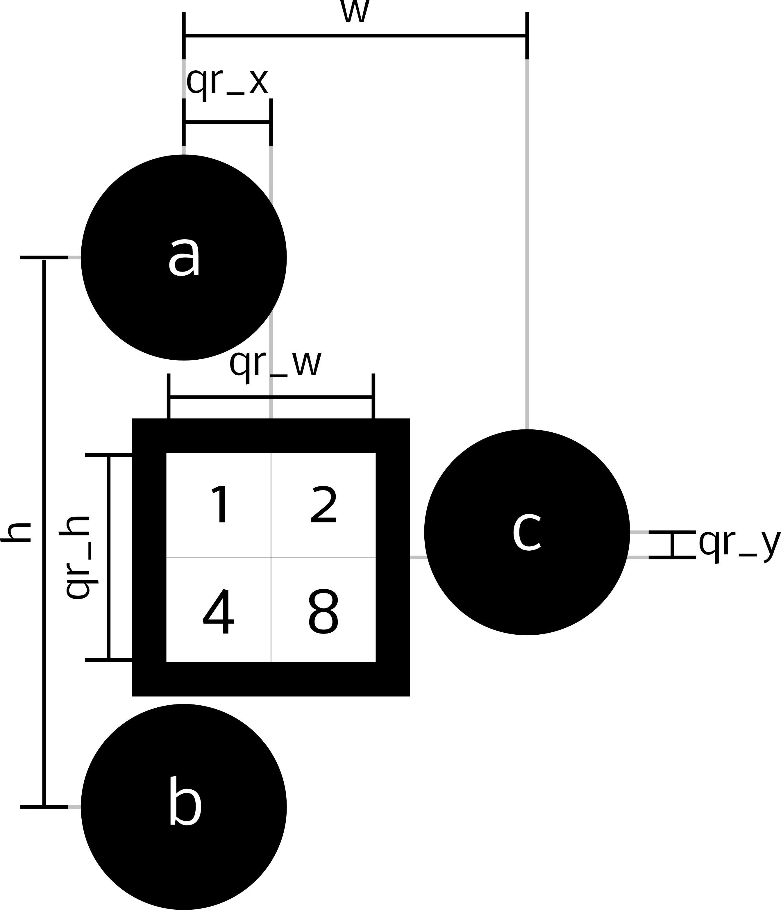

Project Eagle provides a holistic solution to the free space localization problem, often encountered both in academia and industry. Project Eagle's key features are:
* multiple camera modules work seemlessly together to oversee an area larger than their individual fields of view
* a calibration GUI facilitates the deployment or expansion of the system
* cameras broadcast their measurements on the network to everyone listening

## The Hardware
Each module consists of:
* a [Odroid XU4](http://www.hardkernel.com/main/products/prdt_info.php?g_code=G143452239825)
* a [oCam 5MP](http://www.hardkernel.com/main/products/prdt_info.php?g_code=G145231889365) camera
* a wide angle lens (e.g. M12 - f2.5mm - 130&deg;)
* a wifi dongle (any type will do really)

## The Software
The software and its dependecies need to be installed on each of the modules. When multiple modules are installed, it is advised to make an image of one fully installed module and write it to the other modules as this is usually faster than installing all software on each of the modules separately. Some information on the suggested procedure is found [here](https://raspberrypi.stackexchange.com/questions/311/how-do-i-backup-my-raspberry-pi).
Installation instructions are found below.

### Dependencies
Install the following packages:
* cmake version 3.1 or higher
    - check this in the terminal with the command `cmake --version`
    - if not installed, get cmake from the website
* OpenCV 3.2
    - Download source from [here](https://github.com/opencv/opencv/releases).
    - `mkdir build` and `cd build`
    - `cmake -D CMAKE_BUILD_TYPE=Release -D CMAKE_INSTALL_PREFIX=/usr/local ..`
    - `make` and `sudo make install`
* `zyre`, `zmq`, `czmq` and `libsodium`, see [this](https://github.com/zeromq/zyre) for installation instructions.

### Cloning, building and installing the project
Clone the repo:
```
git clone https://github.com/meco-group/ProjectEagle.git
cd ProjectEagle
```
Next, build and install the source:
```
mkdir build
cd build
cmake ..
make
sudo make install
```
Built examples are in `build/bin/`

### Linking Project Eagle with your application
When using `cmake`, add the following to your `CMakeLists.txt`:
```
find_package(eagle REQUIRED)
include_directories(${eagle_INCLUDE_DIRS})
target_link_libraries(MyTarget ${eagle_LIBRARIES})
```

## Calibrating the system
Before mounting the cameras to the ceiling, have a look at the calibration GUI. This is found in the folder gui, and is run from the terminal:
```
cd gui
python gui.py
```
When the GUI launches, an add button should be available. This allows you to add a new module to the system. Once the information is added, you should be able to select it and press calibrate. This opens a live video which comes in handy when mounting the cameras to the ceiling. To calibrate the first camera, take a series of snapshots of a chessboard pattern. Don't forget to throw in a few (more or less 30%) tilted chessboards to allow the camera's distance to the floor to be estimated correctly. 

When installing a second camera, make sure there is a small overlap of the fields of view (it should not be too large, as long as both camera's can see the chessboard). You can use the calibration video stream to make sure of this. To calibrate a second camera, first repeat the previously described calibration procedure. Next, select both cameras in the GUI and press stereo calibrate. Two video streams should now show. Once again, take a few snapshots (make sure both cameras are capable of detecting the chessboard). Once you're finished, press calibrate and you are good to go.

## Running the localization algorithm

The localization algorithm detects obstacles and robots in the environment using a captured camera frame. Obstacles and robots are distinguished from the environment by comparing the captured frame by a capture of the background. To get started, you should capture a new background. This is done by running the BackgroundCmd from the terminal:
```
cd ./build/bin
BackgroundCmd wlan0
```
Make sure to select the right network interface which is usually wlan0. The background should be a background, so remove all robots, obstacles and trash from the workspace.
Robots are identified by using a distinct marker. The figure underneath gives an overview of a marker with its important dimensions.

<div align="center">

</div>

A marker is defined by the following parameters (see `detector.yml`):
* `triangle_ratio`: w/h
* `qr_posx`: qr_x/w
* `qr_posy`: qr_y/h
* `qr_sizex`: qr_w/w
* `qr_sizey`: qr_h/h
* `qr_nbitx`: number of bits in x direction
* `qr_nbity`: number of bits in y direction

A robot's pose is determined using the 3 black disks. In the source code, these markers are always ordered as a, b and c.
The robot's id is determined by decoding the `qr_nbitx`*`qr_nbity` bit QR code in the center of the marker. The value of each bit is illustrated in the figure for a 4 bit QR. A black square means 1, a white square equals 0.

To start the localization algorithm, run the EagleTransmitter from the terminal:
```
EagleTransmitter eagle0
```
When running multiple multiple modules, make sure to change the names of the modules to unique identifiers, e.g. eagle0, eagle1, eagle2, ... For your own convenience, a python script is provided to deploy all eagles at once (deploy_eagles.py in the root folder). Make sure to adapt the parameters in the beginning of the file to your own values.

Receiving information from the system is done by for instance running the ImageReceiver:
```
ImageReceiver wlan0 EAGLE all
```

For more information on receiving information, one is redirected to the executables in ./eagle/exec.
